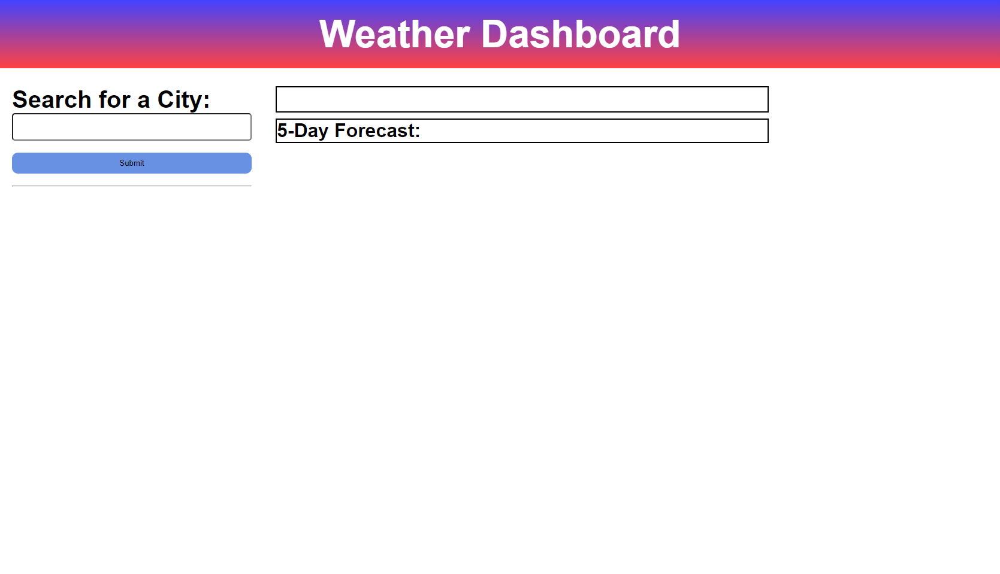

# Weather Forecast

## Description

- This weather allows a user to look up the weather of a city. When the user enters a city, it will show the weather conditions for that current day which includes temperature, wind speed, humidity, and the overall weather (cloudy, rainy, sunny, etc.). In addition to showing the temperature of the current day, it will also show a 5 day forecast for that same city. The 5 day forecast will also show the temperature, wind speed, humidity, and the overall weather for their respective day. When a user searches a different city, the city will be added to a search history list. If a user presses a city from that list, then the weather board will update to show the weather forecast for the city they just pressed in the search history.

* This project was created to get hands on practice will fetching third-party APIs. In this project, I specifically used a weather API that gave the weather of cities for the current day and a five day forecast for that city. By fetching data from this API, it helped me get hands-on practice extracting pertinent data in JSON format.

## Assets

The image below is the Weather Forecast website landing page:

Below is what the page looks like when a user enters a city:

